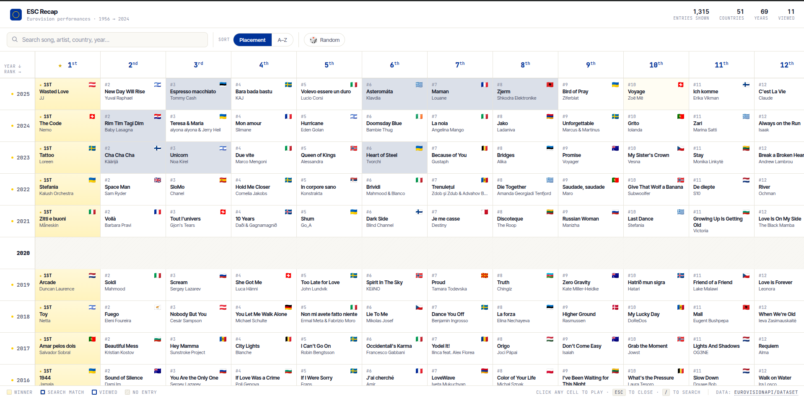
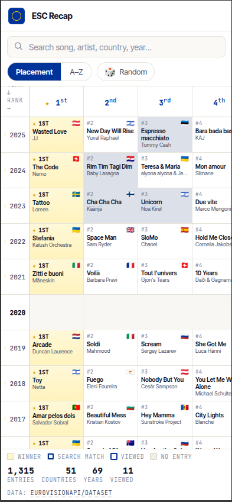
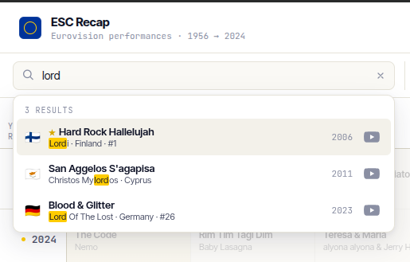
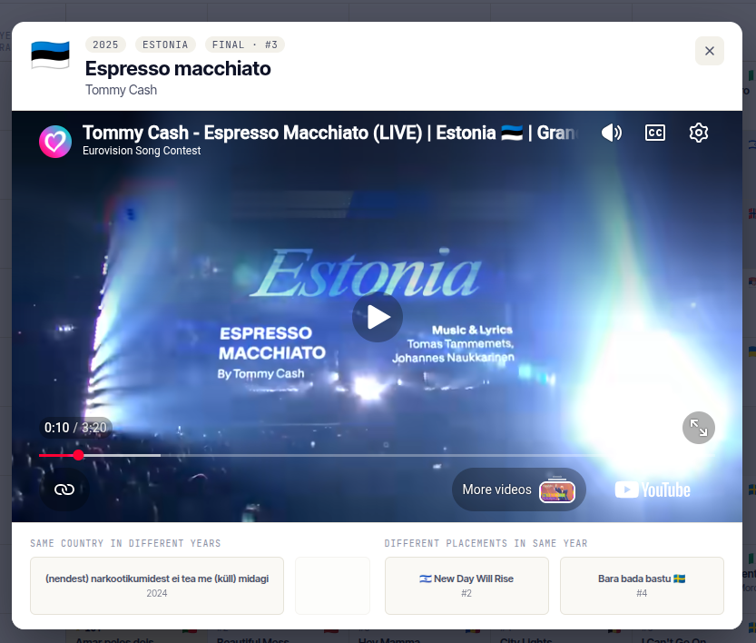

# ESC Recap

An interactive grid explorer of Eurovision Song Contest performances from 1956 to 2024.

## What it does

Browse the complete history of Eurovision entries organized as an interactive grid. Switch between two views:
- **Placement view**: See songs ranked by their final placement for each year
- **Alphabetical view**: Browse countries alphabetically

## Features

- **Search**: Find songs, artists, countries, or years instantly (press `/` to focus)
- **Watch videos**: Click any entry to watch the performance on YouTube
- **Navigation**: Jump between entries by country across years or by placement within a year
- **Viewing history**: Track which entries you've watched with visual markers
- **Statistics**: See entries shown, countries represented, and how many you've viewed
- **Responsive design**: Works seamlessly on desktop and mobile

## Data

All performance data sourced from [EurovisionAPI/dataset](https://github.com/EurovisionAPI/dataset).

## How to use

- **Click any cell** to watch the video
- **Search** for a song, artist, country, or year
- **Random button** (🎲) opens a random entry
- **Sort buttons** switch between placement and alphabetical views
- **Viewed indicator** shows entries you've already watched (blue border)
- **Navigation buttons** in the modal let you explore related entries
- **Esc key** closes the modal
